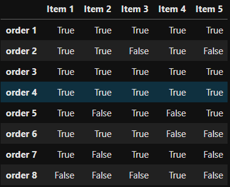
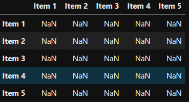
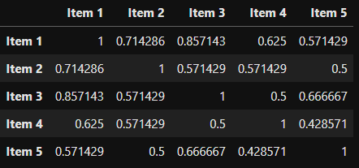
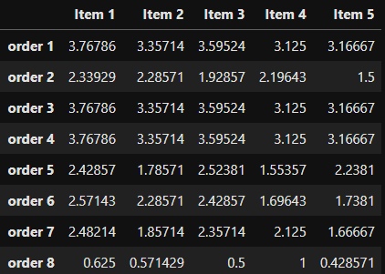
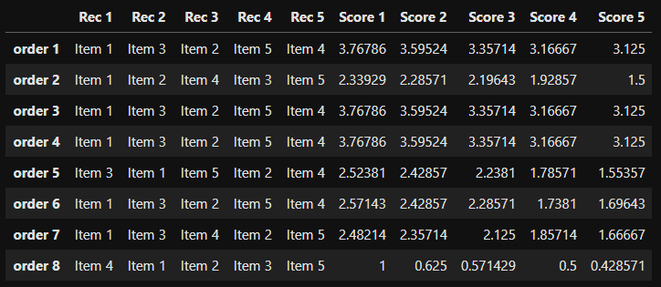

# Recommendation-system

The aim of this project is to recommend products using various similarity scores when products purchased, the brand of the products, the purchase order, stock keeping units (sku), and two levels higher above the product level namely, 'l1' and 'l2'.

# Methodology

I took an object oriented approach to solve this problem. I created two different classes, 'data_prep' , 'recommender_class'. I use the above mentioned classes in my notebook for the following purposes:

- Data preparation - For explanation purposes, I have created a simple matrix.Removed those entries whose number of orders count were less than 3 and created dummies for the product column. Converted the matrix into boolean type.
- Creating a recommender system
      - The boolean matrix prepared by me for finding Jaccard similarity scores between two items.
      <div align=center>
      
      </div>
      - Created an empty symmetric matrix that contains only the item names in both the rows and columns.
      <div align=center>
      
      </div>
      - Obtained similarity scores by applying Jaccard similarity formula (intersection / union) on the boolean matrix.
      <div align=center>
      
      </div>
      - Dot product is performed between the boolean matrix and the similarity matrix to create the recommendation matrix.
      <div align=center>
      
      </div>
      - Sorted the similarity scores in the descending order and accordingly, recommended the products.
      <div align=center>
      
      </div>
      
## Technologies/Libraries Used
  ```
 - Python 3
 - Jupyter
 - Pandas
 - Numpy
 - Seaborn
 - Scikit-Learn
 - itertools
 ```
 
 ## Dataset 
 
 The dataset consists of five columns:
 
 -  **Order Number:** The boolean matrix was created based on each unique order number using groupby method.
 -  **L1:** The least granular level of products
 -  **L2:** The second level of products
 -  **L3:** The products purchased
 -  **sku:** The stock keeping units of the products
 -  **brand:** The brand associated with each product
 
 ## Summary

*Applying Jaccard similarity score, a recommender engine was created.This model can be used as a guide when determining which products to recommend to customers who have the same purchase behaviour.*
      

